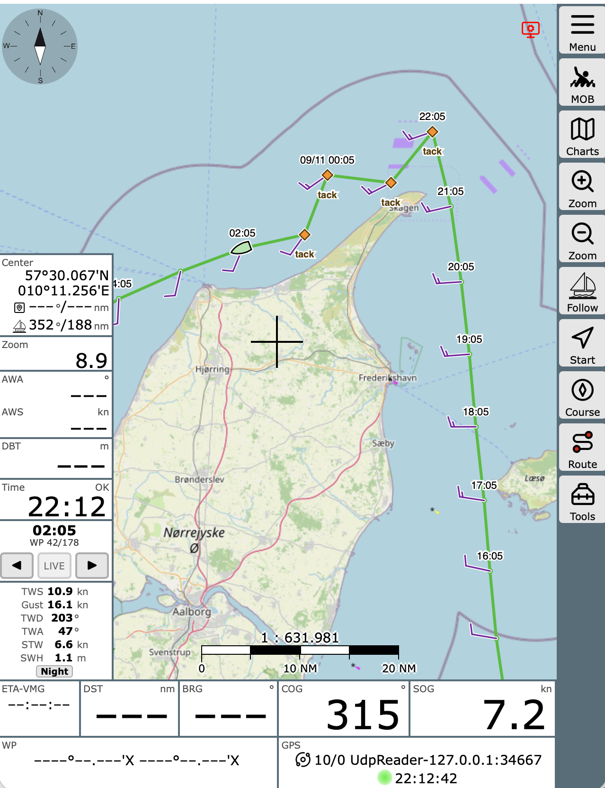

# AvNav Weather Route Viewer

An [AvNav](https://www.wellenvogel.net/software/avnav/docs/beschreibung.html?lang=en)
plugin that shows a route exported by weather-routing software on the chart,
together with the data the router computed for every waypoint: arrival time,
wind, boat speed, waves, tacks, engine and night legs. A boat marker moves
along the route with time, either live or stepped through by hand.

The route is drawn as a separate reference layer. AvNav's own active route is
never touched.



## Requirements

- AvNav 
- A GPX file whose route points carry a `<time>`, ideally with the
  weather-routing extensions described below.

## Installation

1. Copy the `weather-route-viewer` directory into AvNav's plugin directory:

   ```
   sudo cp -r weather-route-viewer /var/lib/avnav/plugins/
   ```

2. Restart AvNav.

## Usage

### 1. Upload the route

In AvNav's main menu open **CSS, JS, User Apps**, then **Upload file** in the
**User Files** column and pick the `.gpx` file. The plugin reads the route from
there. Do not import it as a normal AvNav route: AvNav strips the times and
extensions on import.

The plugin checks the user files every 10 seconds. When the route is
recalculated, upload the new file under the same name and the chart follows
within a few seconds; no reload is needed.

#### Uploading from an iPhone

AvNav takes the file over HTTP, so an iOS Shortcut can upload a route straight
from the phone:

1. New shortcut, action **Get File** (Files) with *Show Document Picker* on.
2. Action **Get Contents of URL**
   - URL: `http://<avnav>:8080/api/user/upload?name=route.gpx&overwrite=true`
   - Method **POST**
   - Header `Content-Type` = `application/octet-stream`
   - Request Body **File** -> the output of *Get File*
3. Optional: **Show Notification** with the result (`{"status": "OK"}`).

Run it, pick the `.gpx`, done. Keep the name fixed and set the layer's
`routeFile` to it, so each upload replaces the route on the chart.

The body must be the raw file: a *Form* (multipart) body or the default
`application/x-www-form-urlencoded` makes the server consume the stream as
form fields and the request then hangs. Without `overwrite=true` a second
upload of the same name fails with 409. Names may not start with `__`.

To share the file into the shortcut instead, turn on **Show in Share Sheet**
in its details and make sure *Share Sheet Types* includes **Files**.

### 2. Add the widgets to a layout

Open the main menu, choose **Layouts** and edit the current layout.

- **WRRouteLayer** draws the route on the chart. It is a map widget: click
  **On Map** in the edit toolbar, then **+** and select it.
- **WRRouteControl** shows the selected time and waypoint, with ◀ / ▶ buttons
  to step through the route and a **LIVE** button to return to the current
  time. Add it to a normal widget panel.
- **WRRoutePoint** shows the router's data for the current waypoint. Add it
  to a normal widget panel.

Click **Finished** to save the layout.

### 3. On the chart

The map layer shows the route line, a dot and the arrival time at every
waypoint, wind barbs for the true wind at the boat, a diamond at each tack or
gybe, dashed stretches where the router assumed engine, and the boat marker.
In live mode the marker sits where the boat should be right now. With ◀ / ▶
it jumps from waypoint to waypoint and the detail widget follows.

Times are shown in the browser's local time zone, like all other AvNav
widgets. Speeds and directions use AvNav's own formatters.

## Parameters

Set in the layout editor by clicking the widget.

**WRRouteLayer**

| Parameter | Default | Meaning |
|---|---|---|
| `routeFile` | empty | Name of the `.gpx` user file, exactly as listed. Empty uses the first `.gpx` found. |
| `showBarbs` | on | Draw wind barbs along the route. |
| `routeLineColor` | `#27BE27` | Colour of the route line. Clear it to use AvNav's route colour. |
| `barbSpacing` | 55 | Minimum distance between barbs, in pixels. |
| `showMetadata` | on | Draw tack/gybe markers and engine stretches. |

**WRRoutePoint** has one on/off switch per line: `showWp`, `showTime`,
`showGws`, `showGwd`, `showTws`, `showGust`, `showTwd`, `showTwa`, `showAws`,
`showAwa`, `showStw`, `showCtw`, `showSog`, `showCog`, `showSwh`, `showPeriod`,
`showWaveDir`, `showMotorSpeed`, `showMotorBelowTws` and `showFlags`.
True wind, gust, boat speed, waves and the tack/night/engine flags are on by
default.

**WRRouteControl** has no parameters.

## GPX format

The plugin reads a `<rte>` (or, failing that, a `<trk>`) whose points carry a
`<time>` element and extensions in the namespace `urn:weather-router:gpx:2`:

```xml
<gpx xmlns="http://www.topografix.com/GPX/1/1" xmlns:wr="urn:weather-router:gpx:2">
  <metadata>
    <extensions>
      <wr:units tws="kn" twd="deg" swh="m" .../>
      <wr:motorSpeed>6</wr:motorSpeed>          <!-- optional route settings -->
    </extensions>
  </metadata>
  <rte>
    <rtept lat="54.4085" lon="11.0243">
      <time>2026-09-09T15:57:00Z</time>
      <extensions>
        <wr:forecast>  <!-- gws gwd gust swh wavePeriod waveDir -->
        <wr:boat>      <!-- tws twd stw sog ctw cog twa awa aws night engine maneuver -->
      </extensions>
    </rtept>
  </rte>
</gpx>
```

All fields are optional; missing values are shown as a dash. `night` and
`engine` are `0`/`1`, `maneuver` is a word such as `tack`.

### Routes without the extensions

A plain GPX whose points carry only a position and a `<time>` - LuckGrib's
weather route export, for example - works too. The route line, the waypoint
dots and the arrival times are drawn as usual and the boat marker moves along
it; the heading then comes from the leg geometry instead of `cog`. There are
no barbs, maneuver markers or engine stretches, because there is no such data.

WRRoutePoint leaves out every line the route has no values for, rather than
showing a column of dashes: for a route like this it shows the waypoint number
and its time. A route that does carry the data is unaffected - there, the
switches in the layout editor decide as before.

## Troubleshooting

- **Nothing on the chart**: check that a `.gpx` file is in the user files and
  that WRRouteLayer is in the layout's map widgets. If `routeFile` is set it
  must match the file name exactly; a name that does not exist shows nothing
  rather than some other file.
- **Widgets missing**: they only appear after being added to a layout.
- The plugin logs messages prefixed `WR:` to the browser console.

